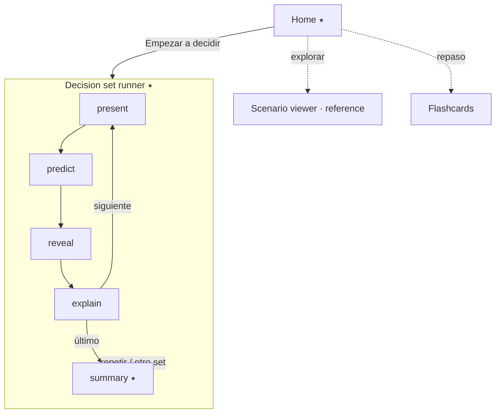

# Screen Flow — Decision Trainer (first release)

Routes reuse the existing hash router. New/changed screens marked ⭑.

## Map

```
/                         Home ⭑ (one clear primary action)
  └─ /train/:setId        Decision set runner ⭑  (the loop)
        step: present  →  predict  →  reveal  →  explain  →  (next | summary)
  └─ /train/:setId/summary  Set summary ⭑
/experiments/:id          Experiment detail        (kept, demoted)
/experiments/:id/scenarios/:sid   Scenario viewer  (kept as "explore/reference" mode)
/flashcards               Flashcards               (kept, demoted to "repaso")
```

## Screen-by-screen with states

### Home ⭑
- **Primary action:** "Empezar a decidir" → launches the first decision set.
- Secondary, visually quieter: "Explorar escenarios" (current experiment list) and "Repaso con flashcards".
- States: `loading` (index fetch), `error` (retry, existing `ErrorState`), `empty` (no sets published).
- Removes the current split-brain of two co-equal entry points.

### Decision set runner ⭑ — five internal states

1. **present** — LJ chart only. Control limits visible; **no** trigger colors, **no** rule table, **no** educational text. Prompt: "¿Aceptas o rechazas esta corrida?"
2. **predict** — controls active:
   - `Aceptar` / `Rechazar` (required).
   - If `Rechazar`: rule selector (`1_2s`, `1_3s`, `2_2s`, shown with plain-language labels) + "toca el primer punto que rompe la regla" on the chart.
   - `Confirmar decisión` locks the answer. No back-out after lock (protects the prediction).
3. **reveal** — same chart, now with the true first-trigger point(s) colored and the rule result shown. A clear correct/incorrect banner.
4. **explain** — short rationale tied to the student's specific answer; misconception note if their error matches a known pattern.
5. transition: `Siguiente` → next scenario (`present`), or after the last → **summary**.
- Cross-cutting states: `loading` per scenario, `error` (retry), `empty` (set has no scenarios).

### Set summary ⭑
- "X / N correctas." One line naming the pattern they handled well and the one they missed (derived from per-scenario error type).
- Actions: "Repetir set", "Otro set", "Volver al inicio".
- Progress stored in `localStorage` (per set), mirroring the flashcard repository pattern.

### Scenario viewer (kept as reference mode)
- The existing all-at-once view survives as an explicit **"Explorar"** mode for review after deciding — not the default first contact. Clearly labeled so students know answers are shown.

### Flashcards (kept, demoted)
- Remains for recall practice under "Repaso". No longer competes for the first screen.

## Interaction & feedback rules

- The decision interaction lives **on the chart** (tap the offending point), not only in text controls — this is what separates it from a quiz.
- Nothing about the answer is visible in `present`/`predict`. The reveal is the reward for committing.
- One decision per scenario; no scores, timers, or streaks.

## Mermaid overview


